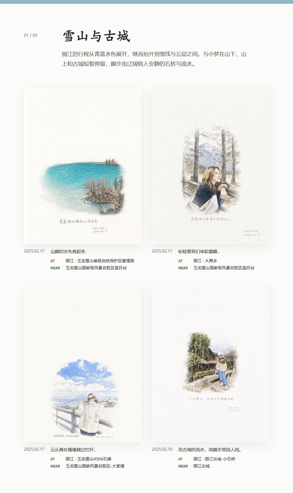
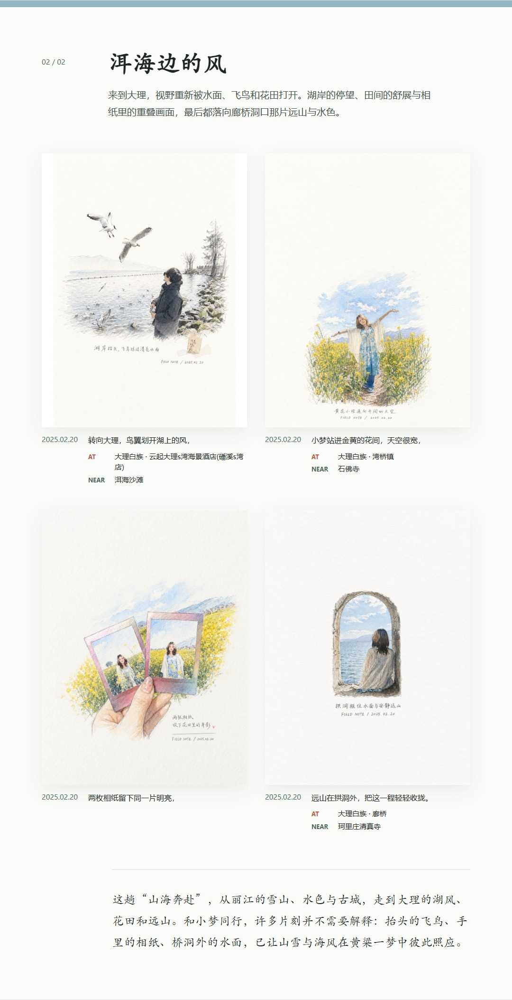

# 旅迹编年

<p align="center">
  
</p>

<p align="center"><strong>把散落在相册里的旅行照片，编成一册有时间、地点和诗意的手绘纪行。</strong></p>

旅迹编年不是给照片套一层滤镜。它会理解一整段旅程：按拍摄时间整理照片，过滤近似画面，从中挑出更有叙事价值的瞬间，结合 EXIF 地点组织章节与路线，为每张照片生成统一的白纸手绘页，最后交付可离线浏览的 Web 相册、朋友圈章节长图和分享 ZIP。

## 一个真实案例：山海奔赴

> 与小梦，从丽江的雪到大理的风。

“山海奔赴”记录了 2025 年 2 月 17 日至 20 日的一段丽江、大理之旅。项目从 23 张上传照片中选出 8 张，将行程整理成“雪山与古城”和“洱海边的风”两章，并从照片 GPS 中解析出 7 处拍摄地点。原本分散的雪山、水色、古城、飞鸟、花田与廊桥，因此成为一条完整的叙事线。

| 输入与产物 | “山海奔赴”案例 |
| --- | --- |
| 上传照片 | 23 张 |
| 叙事选片 | 8 张 |
| 章节 | 2 章：雪山与古城、洱海边的风 |
| 地点路线 | 7 处可公开展示的拍摄地 |
| 最终交付 | 离线相册、封面、2 张章节长图、分享 ZIP |

图片内部的手写短句描述单张画面；相册页面下方则使用另一组连续诗行。按照片顺序读下来，它们共同组成一首完整的诗：

> 山脚的水先亮起来，<br>
> 松枝替我们举起雪峰，<br>
> 云从高处缓缓越过栏杆，<br>
> 而古城的流水，将脚步带回人间。<br>
> 转向大理，鸟翼划开湖上的风，<br>
> 小梦站进金黄的花间，天空很宽，<br>
> 两枚相纸留下同一片明亮，<br>
> 远山在拱洞外，把这一程轻轻收拢。

下面两张长图均由项目直接导出，不是设计稿或后期拼图。

| 雪山与古城 | 洱海边的风 |
| --- | --- |
|  |  |

## 项目亮点

- **从“好照片”中找到“好故事”**：先读取拍摄时间与画面信息，再过滤近似照片、进行视觉理解和叙事选片。结果不是简单的时间流水账，而是有开场、转折和收束的旅程。
- **让地点真正参与叙事**：有 EXIF GPS 时，通过高德逆地理编码得到拍摄地 `AT`，并在附近筛选有叙事价值的景区、公园、博物馆、历史文化或自然地标 `NEAR`。两者明确区分，避免把“附近”误写成“到访”。
- **一张照片，两层文案**：手绘图片内部保留适合单张画面的短句；Web 相册和分享长图使用独立诗行，所有诗行顺序相连，构成风格统一的完整诗。
- **统一的旅行手记风格**：入选照片按照固定版本的 `photo-revival` 规则重新绘制，保留人物、环境和关键物件，同时统一成克制的白纸、水彩与手写笔记质感。
- **生成结果可以直接交付**：一次任务同时生成离线 HTML、结构化 `album.json`、朋友圈章节长图和不含原图的分享 ZIP，不需要再手工排版。
- **长任务也能可靠运行**：图片按可配置并发度分批生成，失败图片自动进入重试；任务支持暂停、继续和终止重试，并持续保存断点。刷新或关闭浏览器不会终止正在运行的任务。
- **错误可追踪，敏感信息不进日志**：控制台和文件日志包含任务 ID、处理阶段及异常堆栈，同时脱敏 OpenAI、高德 API Key，并且不记录照片原始经纬度。

## 处理流程

```text
上传照片
  -> 读取 EXIF 时间与 GPS
  -> 感知哈希过滤近似照片
  -> 批量视觉理解与叙事选片
  -> 逆地理编码与附近地标筛选
  -> 生成章节、旁白和连续诗行
  -> 并发绘制统一风格的旅行手记页
  -> 导出离线相册、章节长图与分享 ZIP
```

如果照片没有 GPS，或没有配置高德 Key，地点增强会自动跳过，不影响其余相册生成流程。

## 快速开始

运行环境：Python 3.11+、Node.js 18+。安装脚本会安装 Python 依赖、前端依赖，以及长图导出所需的 Chromium。

Windows：

```powershell
.\install.bat
# 编辑项目根目录的 .env
.\start.bat
```

macOS：

```bash
./install.command
# 编辑项目根目录的 .env
./start.command
```

启动后访问 <http://127.0.0.1:8000>。开发模式下，Windows 运行 `dev.bat`，macOS 运行 `dev.command`；React 使用 `5173` 端口，FastAPI 使用 `8000` 端口。

## 配置

安装完成后编辑 `.env`。完整参数和默认值见 [`.env.example`](.env.example)。

| 参数 | 作用 | 默认值 |
| --- | --- | --- |
| `OPENAI_BASE_URL` | OpenAI 兼容接口地址 | 需要配置 |
| `OPENAI_API_KEY` | 接口密钥 | 需要配置 |
| `OPENAI_TEXT_MODEL` | 支持图片理解的文本模型 | 需要配置 |
| `OPENAI_IMAGE_MODEL` | 手绘图片生成模型 | `gpt-image-1` |
| `AMAP_API_KEY` | 高德 Web 服务 Key，用于地址和附近地标 | 留空则跳过地点增强 |
| `IMAGE_GENERATION_INTERVAL_SECONDS` | 相邻图片生成批次之间的等待秒数 | `10` |
| `IMAGE_GENERATION_CONCURRENCY` | 每批同时生成的图片数 | `3` |
| `VISION_BATCH_SIZE` | 单次视觉理解批量大小 | `4` |
| `LOCATION_CLUSTER_RADIUS_METERS` | 可复用同一次地点查询的照片聚类半径 | `200` |
| `LOG_LEVEL` | `DEBUG`、`INFO`、`WARNING` 或 `ERROR` | `INFO` |
| `PLAYWRIGHT_BROWSER_PATH` | 长图导出使用的浏览器路径 | 留空时自动查找 |

高德 Key 可在[高德开放平台控制台](https://console.amap.com/dev/key/app)申请。创建应用并添加 Key 时，服务平台请选择“Web 服务”，不是“Web 端 JS API”。

## 输出内容

每本相册保存在 `outputs/<旅行名称>/`：

```text
index.html              可离线浏览的完整相册
share.html              用于导出分享长图的排版页
album.json              结构化相册数据
assets/photos/          photo-revival 手绘成片
sources/                入选照片的原图副本
exports/                封面与朋友圈章节长图
<旅行名称>.zip          不包含 sources 的分享包
```

EXIF 原始经纬度、完整地址以及附近地标的距离和评分，仅保存在本机 `.jobs/` 的任务断点中。公开 Web 页面、`album.json`、章节长图和分享 ZIP 只包含简短地点名称。相册封面路线只使用真实拍摄地 `AT`，连续重复的 `AT / NEAR` 组合也会在分享长图中自动省略。

## 任务与日志

同一时间只执行一个相册任务，任务内部按 `IMAGE_GENERATION_CONCURRENCY` 分批并发生成图片；设置为 `1` 可恢复串行。`IMAGE_GENERATION_INTERVAL_SECONDS` 控制相邻批次之间的等待时间。暂停任务或终止重试时，当前批次中已经发出的请求会先结束，但不会启动下一批。

日志写入 `logs/travel-journal.log`。单个文件达到 5 MB 后自动轮转，默认保留 5 份历史日志。排查失败任务时，可优先搜索 `pipeline_failed`、`location_lookup_failed`、`image_generation_failed`、`share_image_export_failed` 或 `request_failed`。

## 技术栈与开发

- FastAPI + Uvicorn：任务 API 与相册静态服务
- React + TypeScript + Vite：任务创建与进度界面
- Pillow + ImageHash：图片预处理、EXIF 解析与近似图过滤
- OpenAI Python SDK：视觉理解、故事生成和图片生成
- 高德 Web 服务：国内地址解析与附近地标检索
- Jinja2 + Playwright：离线相册渲染与章节长图导出

运行测试：

```shell
# Windows
.\.app-venv\Scripts\python.exe -m pytest

# macOS
./.app-venv/bin/python -m pytest

npm run build --prefix frontend
```

`third_party/photo-revival` 固定到上游提交 `ca4c3c6c0f812355bd6d815d8a78652db801b7f1`，遵循 MIT License。
